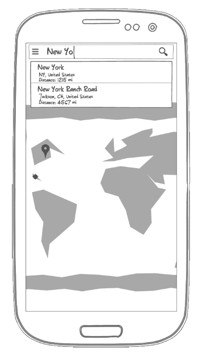

# Android Coding Challenge

## Philosophy
The goal of this challenge is to get insight on how you approach an everyday task, not a hypothetical algorithm unicorn. Complete the challenge by writing code that you would write again any day, code you could pick up with ease 5 years from now, code that makes you proud.

### Values
  * We exclusively use Java, Android Studio and Gradle, please don't go beyond that.
    * (Yes, we know Kotlin is pretty damn cool!)
  * We highly value code cleanliness, reusability, structure and hierarchy.
    * We make extensive use of linting, findbugs, auto-formatters, coverage, UI and unit tests.
  * We are huge fans of popular 3rd party libraries, so use as many as you want.
    * Dagger, Mortar, Flow, Hugo, ButterKnife, Picasso, GreenDAO, Retrofit, RXAndroid, ... you name it.
  * We love modern, material design!
  * We are big fans of small, incremental commits, not 5.000 LoC ``Initial Commit.`` and ``Added stuff.`` monsters.
  * We know StackOverflow et al. exist, getting inspiration from other sources is totally fine as long as you attribute them in your code.
  * We delight our users with a familiar but fresh UX.

### Time
The task is doable on a weekend. It is OK to leave reasonable TODOs in the code, when you ran out of time or took a shortcut, just explain yourself.

Overall, please complete this challenge within ≈2 weeks of receiving.

## The Challenge
Create a simple map application that displays the users current location and allows to search for a location by name. The search results should update as the user types. When a search result is selected, a pin is dropped on the map and the map zooms into the location.

The instructions are intentionally coarse. Surprise us. Think outside of the box.

### Mock
The result could look something like this, but we are always happy to see some creative UI design:

### Deliverable
Preferable a link to a git repo hosted on github (alternatively a zip file of the Android Studio project).
